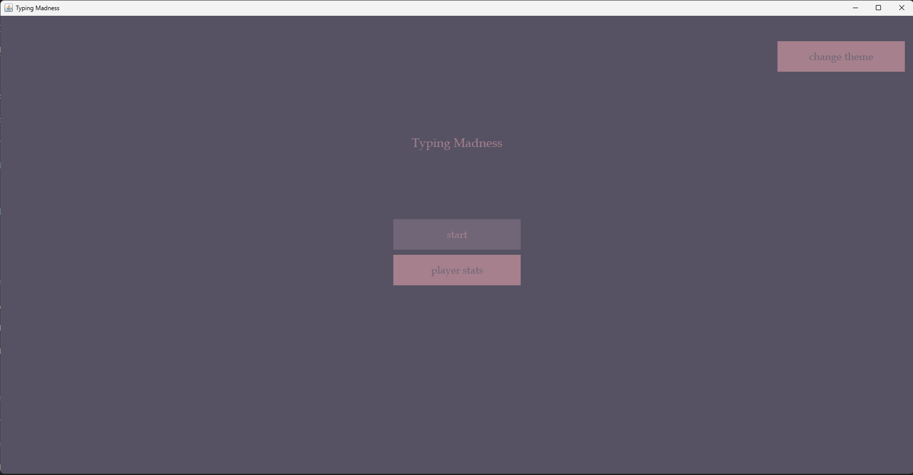
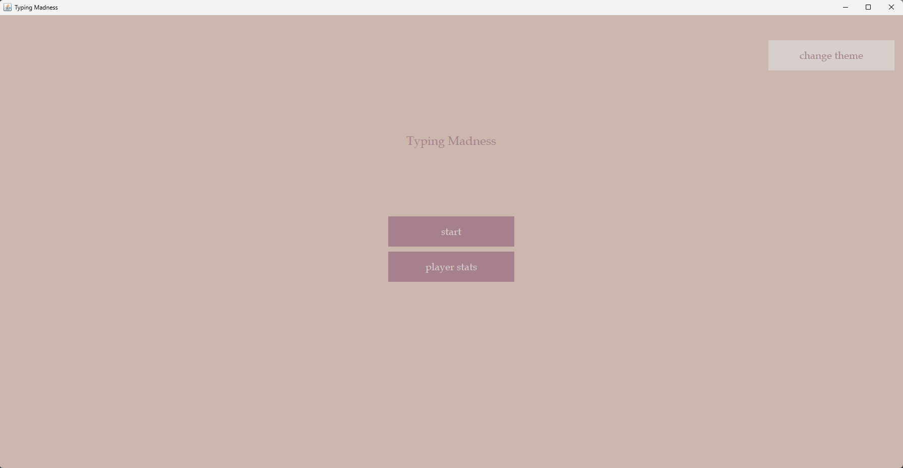
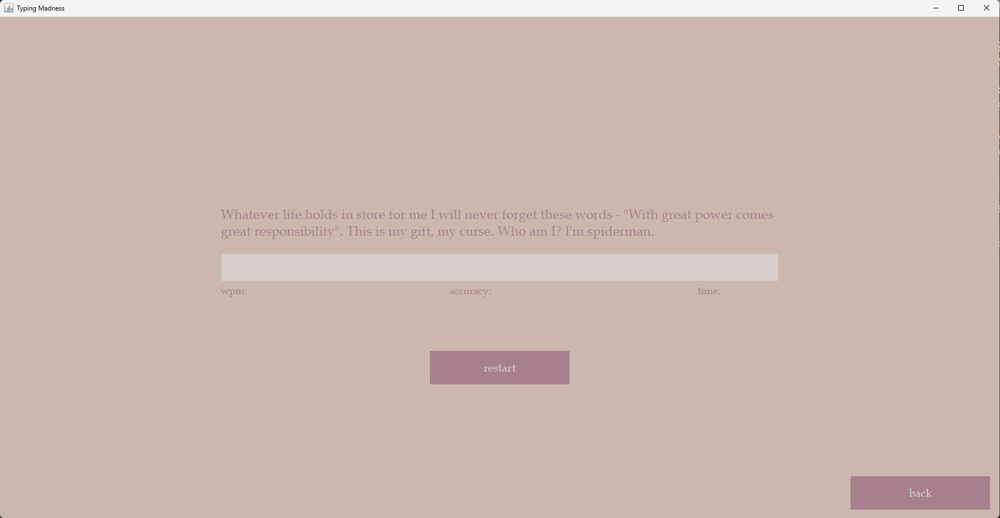
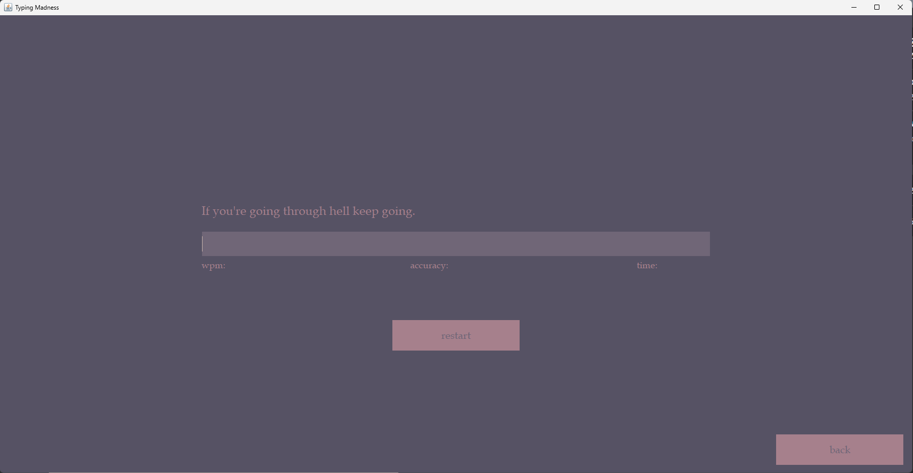
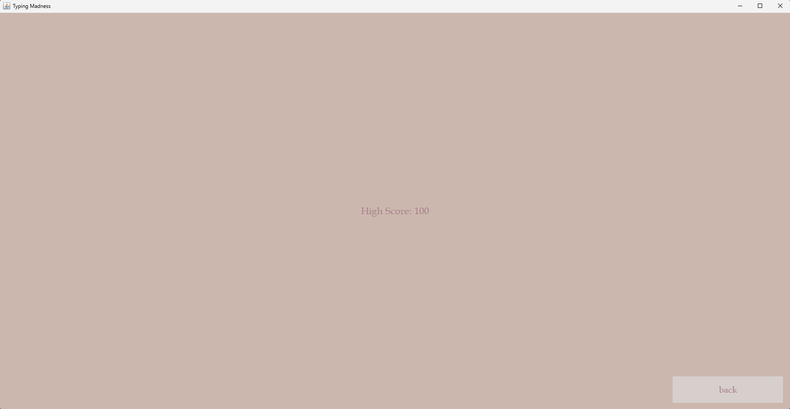

# Typing Madness - Java Typing Test App

Typing Madness is a Java-based typing test application with a user-friendly graphical user interface (GUI). It allows you to test your typing speed and accuracy by providing a random quote that you need to type as quickly and accurately as possible. The app also features a dark mode and light mode for your visual comfort.

## Table of Contents

- [Features](#features)
- [Getting Started](#getting-started)
- [Usage](#usage)
- [Screenshots](#screenshots)

## Features

- Typing Speed Measurement: Test your typing speed by typing a randomly selected quote.

- Accuracy Assessment: Check the accuracy of your typing by comparing your input to the provided quote.

- Time Tracking: Monitor the time it takes to complete the typing test.

- High Scores: Track and display your best typing speed and accuracy scores.

- Dark Mode: Enjoy a sleek and dark-themed user interface for typing in low-light environments.

- Light Mode: Switch to a light-themed UI for a comfortable typing experience during the day.

## Getting Started

To get started with Typing Madness, follow these steps:

1. Ensure you have Java installed on your computer.

2. Download or clone the Typing Madness repository to your local machine.

3. In the 'TypingMadness' folder, navigate to 'bat/TypingMadness.bat'

4. Open the file to start the app.

## Usage

1. Start the application, and you will be greeted with the main typing test interface.

2. Click the "start" button to begin the typing test.

3. Type the displayed quote as accurately and quickly as possible into the provided input box.

4. Once you finish typing the quote, the app will display your typing speed, time taken, and accuracy.

5. If you wish to restart, click the 'restart' button to refresh the test and get a new quote.

6. You can view your high scores by clicking on the "player stats" button on the main menu.

## Screenshots

